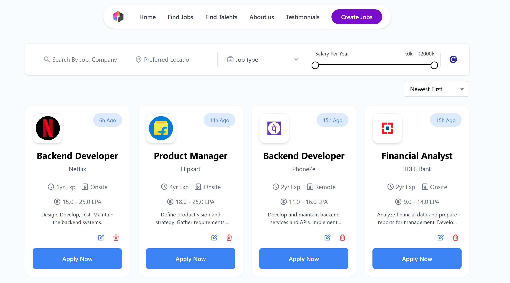

# 🚀 Job Portal - Advanced Job Management Platform



## 📌 Live Demo
👉 [**Visit Job Portal Application**](https://job-portal-delta-nine.vercel.app/) - Explore the live application!


[](https://job-portal-delta-nine.vercel.app/)
[](https://jobadminportal-b2ee96473d89.herokuapp.com/)
[](../LICENSE)

---

## 📋 Table of Contents

- [Overview](#-overview)
- [Key Features](#-key-features)
- [Tech Stack](#-tech-stack)
- [Project Structure](#-project-structure)
- [API Reference](#-api-reference)
- [Getting Started](#-getting-started)
  - [Prerequisites](#prerequisites)
  - [Installation](#installation)
  - [Running Locally](#running-locally)
- [Deployment](#-deployment)
- [License](#-license)
- [Contact](#-contact)

---

## 🌟 Overview

Job Portal is a modern web application designed to streamline job management processes for both administrators and job seekers. The platform provides a sleek, intuitive interface for posting, searching, filtering, and applying to job listings with real-time data updates.

The platform is built as a full-stack application with a React.js frontend, Spring Boot backend, and PostgreSQL database, offering a comprehensive job posting and application system.

Currently, the platform focuses on the admin interface for managing job posts, with plans to expand the job seeker user role in future updates.

---

## 🎯 Key Features

### 🔍 Advanced Job Search & Filtering
- **Keyword Search** - Find jobs by title, role, company name, or keyword
- **Location Filtering** - Search jobs by preferred location
- **Job Type Selection** - Filter by full-time, part-time, contract, or internship
- **Salary Range Filtering** - Interactive slider to select minimum and maximum salary
- **Sort Options** - Sort by date posted, salary, or experience level

### 📊 Admin Job Management
- **Job Creation** - Easily create new job listings with a comprehensive form
- **Edit & Delete** - Update or remove job listings with a simple interface
- **Real-time Updates** - Changes reflect immediately in the job listings
- **Draft Saving** - Save job listings as drafts (coming soon)

### 💼 Detailed Job Cards
- **Company Branding** - Visual identification with company logos (auto-generated from company name)
- **Job Details** - Clear display of key information (experience required, location, salary)
- **Time Stamps** - Relative time display showing how long ago jobs were posted
- **One-Click Apply** - Streamlined application process
- **Remote Indicators** - Clearly marked remote positions

### 👨‍💻 Technical Features
- **Responsive Design** - Optimized for all devices from mobile to desktop
- **Cursor-based Pagination** - Efficient loading of job listings with "Load More" functionality
- **RESTful API** - Well-structured backend services
- **Data Persistence** - Reliable storage with PostgreSQL
- **Form Validation** - Client and server-side validation for data integrity

---

## 🔧 Tech Stack

### Frontend
- **React.js** - UI library
- **React Router** - Navigation and routing
- **React Hook Form** - Form handling and validation
- **Axios** - API requests
- **Tailwind CSS** - Styling and UI components
- **Moment.js** - Time formatting

### Backend
- **Spring Boot** - Java-based backend framework
- **Spring Data JPA** - Data access layer
- **Hibernate** - ORM tool
- **Maven** - Dependency management

### Database
- **PostgreSQL** - Primary database (hosted on Amazon RDS)

### DevOps & Deployment
- **Vercel** - Frontend hosting
- **Heroku** - Backend hosting
- **Amazon RDS** - Database hosting
- **Git & GitHub** - Version control

---

## 📂 Project Structure

```
job-portal/
│
├── frontend/                   # React frontend application
│   ├── public/                 # Static files
│   ├── src/
│   │   ├── assets/             # Images, fonts, etc.
│   │   ├── components/         # Reusable UI components
│   │   │   ├── layout/         # Layout components (Header, MainLayout)
│   │   │   ├── ui/             # UI components (Button, Input, Select, RangeSlider)
│   │   │   └── job/            # Job-related components (JobCard, JobForm, FilterSection)
│   │   ├── pages/              # Page components (Jobs, CreateJob, EditJob)
│   │   ├── services/           # API service functions
│   │   ├── App.jsx             # Main application component
│   │   └── index.jsx           # Application entry point
│   ├── package.json            # NPM dependencies and scripts
│   └── tailwind.config.js      # Tailwind CSS configuration
│
├── backend/                    # Spring Boot backend application
│   ├── src/
│   │   ├── main/
│   │   │   ├── java/com/nikhildev/projects/job_portal/
│   │   │   │   ├── config/     # Configuration classes
│   │   │   │   ├── controllers/ # REST API controllers (JobController)
│   │   │   │   ├── dto/        # Data Transfer Objects (JobRequest, JobResponse)
│   │   │   │   ├── exceptions/  # Exception handlers (ResourceNotFoundException)
│   │   │   │   ├── models/      # Entity models (Job)
│   │   │   │   ├── repositories/ # Data repositories (JobRepository)
│   │   │   │   └── services/    # Business logic (JobService)
│   │   │   └── resources/      # Application properties
│   │   └── test/               # Test classes
│   └── pom.xml                 # Maven dependencies
│
└── README.md                   # Project documentation
```

---

## 📡 API Reference

### Base URL
```
https://jobadminportal-b2ee96473d89.herokuapp.com
```

### Authentication
Currently, the API is open for development purposes. Authentication will be implemented in a future update.

### Endpoints

#### Jobs

| Method | Endpoint | Description |
|--------|----------|-------------|
| GET    | `/jobs` | Get all jobs with filtering and pagination |
| GET    | `/jobs/{id}` | Get job by ID |
| POST   | `/jobs` | Create a new job |
| PUT    | `/jobs/{id}` | Update a job |
| DELETE | `/jobs/{id}` | Delete a job |

#### Query Parameters for `/jobs`

| Parameter | Type | Description |
|-----------|------|-------------|
| `title` | string | Filter by job title or company name |
| `location` | string | Filter by location |
| `jobType` | string | Filter by job type (FullTime, PartTime, Contract, Internship) |
| `minSalary` | number | Filter by minimum salary |
| `maxSalary` | number | Filter by maximum salary |
| `cursor` | string | Cursor for pagination |
| `limit` | integer | Number of items to return (default: 12) |
| `sortBy` | string | Sort field (salary, experience, createdAt) |
| `sortDirection` | string | Sort direction (asc, desc) |

#### Sample API Request
```javascript
// Get all full-time jobs in Bangalore with salary range 50k-100k
GET /jobs?jobType=FullTime&location=Bangalore&minSalary=50000&maxSalary=100000&sortBy=createdAt&sortDirection=desc
```

#### Sample Response Format
```json
{
  "data": [
    {
      "id": "550e8400-e29b-41d4-a716-446655440000",
      "title": "Senior Software Engineer",
      "companyName": "Tech Solutions",
      "location": "Bangalore",
      "jobType": "FullTime",
      "minSalary": 800000,
      "maxSalary": 1200000,
      "description": "We are looking for a skilled senior software engineer...",
      "requirements": "5+ years of experience in Java/Spring...",
      "responsibilities": "Lead development of new features...",
      "applicationDeadline": "2025-06-30",
      "isRemote": false,
      "experienceYears": 5,
      "createdAt": "2025-05-15T10:30:00",
      "updatedAt": "2025-05-15T10:30:00"
    }
  ],
  "nextCursor": "550e8400-e29b-41d4-a716-446655440001",
  "hasMore": true
}
```

---

## 🚀 Getting Started

### Prerequisites

- Node.js (v16+)
- Java 17
- Maven 3.8+
- PostgreSQL 13+
- Git

### Installation

#### Clone the repository
```bash
git clone https://github.com/yourusername/job-portal.git
cd job-portal
```

#### Set up the backend
```bash
cd backend

# Configure the database connection in src/main/resources/application.properties
# Sample:
# spring.datasource.url=jdbc:postgresql://localhost:5432/jobportal
# spring.datasource.username=postgres
# spring.datasource.password=password

# Build the project
mvn clean install

# Run the application
mvn spring-boot:run
```

#### Set up the frontend
```bash
cd frontend

# Install dependencies
npm install

# Configure the environment variables in .env file
# Example:
# REACT_APP_API_URL=http://localhost:8080

# Start the development server
npm start
```

### Running Locally

Once both the frontend and backend are set up, you can access:
- Frontend: http://localhost:3000
- Backend API: http://localhost:8080

---

## 🌐 Deployment

The application is deployed across multiple platforms:

### Frontend (Vercel)
- Deployment URL: [https://job-portal-delta-nine.vercel.app/](https://job-portal-delta-nine.vercel.app/)
- CI/CD: Automatic deployments from the main branch

### Backend (Heroku)
- API URL: [https://jobadminportal-b2ee96473d89.herokuapp.com/](https://jobadminportal-b2ee96473d89.herokuapp.com/)
- Deployment: Git-based deployment from the main branch

### Database (Amazon RDS)
- PostgreSQL instance running on AWS RDS for data persistence

---

## 📄 License

This project is licensed under the MIT License - see the [LICENSE](../LICENSE) file for details.

---

## 📬 Contact

For questions, suggestions, or support, please reach out:

- **Email**: [arrnikhil@gmail.com](mailto:arrnikhil@gmail.com)
- **GitHub**: [Nikhildev0904](https://github.com/Nikhildev0904)
- **LinkedIn**: [Nikhil Dev Arepu](https://linkedin.com/in/nikhil-dev-arepu/)

---

## 🙏 Acknowledgements

- [Tailwind CSS](https://tailwindcss.com/) for the UI components
- [React Hook Form](https://react-hook-form.com/) for form handling
- [Clearbit](https://clearbit.com/) for company logo API
- [Spring Boot](https://spring.io/projects/spring-boot) for the backend framework
