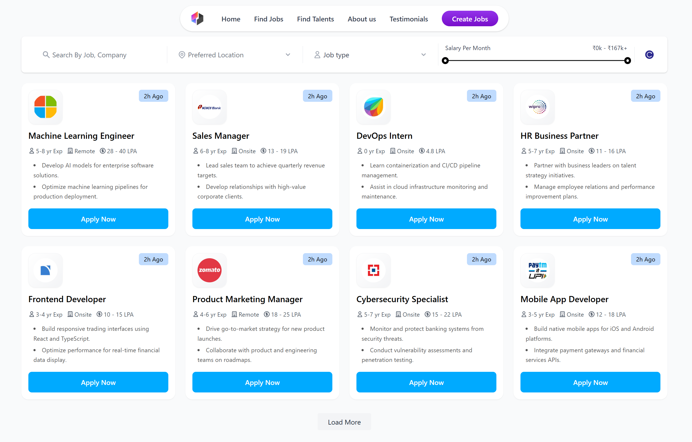

# 🚀 Job Portal - Advanced Job Discovery Platform



## 📌 Live Demo
👉 [**Visit Job Portal Application**](https://job-portal-delta-nine.vercel.app/) - Explore the live application!

[](https://job-portal-delta-nine.vercel.app/)
[](https://jobadminportal-b2ee96473d89.herokuapp.com/)
[](../LICENSE)

---

## 📋 Table of Contents

- [Overview](#-overview)
- [Key Features](#-key-features)
- [Advanced Filtering System](#-advanced-filtering-system)
- [Tech Stack](#-tech-stack)
- [Project Structure](#-project-structure)
- [API Reference](#-api-reference)
- [Getting Started](#-getting-started)
- [Deployment](#-deployment)
- [License](#-license)
- [Contact](#-contact)

---

## 🌟 Overview

Job Portal is a modern, responsive web application designed for efficient job discovery and management. The platform provides an intuitive interface for browsing, searching, and filtering job listings with real-time data updates and advanced filtering capabilities.

Built as a full-stack application with React.js frontend and Spring Boot backend, the platform offers a comprehensive job discovery system with intelligent search algorithms and user-friendly filtering options.

**Current Focus:** Job discovery and browsing interface with plans to expand admin management and user authentication features.

---

## 🎯 Key Features

### 🔍 **Intelligent Job Search & Discovery**
- **Smart Search** - Find jobs by title, company name, or keywords with real-time suggestions
- **Multi-Field Filtering** - Advanced filtering by location, job type, and salary range
- **Interactive Salary Range** - Visual slider for precise salary filtering with monthly/yearly conversion
- **Remote Job Detection** - Easy discovery of remote positions
- **Sort & Organize** - Sort by date, salary, or experience level

### 💼 **Enhanced Job Cards**
- **Visual Company Branding** - Auto-generated company logos using Clearbit API
- **Comprehensive Job Details** - Clear display of salary, experience, location, and job type
- **Smart Time Display** - Relative timestamps showing posting recency
- **Responsive Design** - Optimized viewing across all device sizes
- **Quick Apply Access** - Streamlined application process

### 🎨 **Modern User Experience**
- **Responsive Grid Layout** - Adaptive job card layout (1-4 columns based on screen size)
- **Infinite Loading** - Cursor-based pagination with "Load More" functionality
- **Real-time Filtering** - Instant results as you adjust filters
- **Mobile-First Design** - Touch-optimized for mobile devices
- **Loading States** - Smooth loading animations and feedback

### 🔧 **Technical Excellence**
- **Performance Optimized** - Efficient API calls with cursor-based pagination
- **Error Handling** - Comprehensive error management and user feedback
- **SEO Friendly** - Proper routing and meta tags
- **Accessibility** - WCAG compliant design elements

---

## 🎛️ Advanced Filtering System

Our filtering system is designed to help you find the perfect job quickly and efficiently. Here's how each filter works:

### 🔍 **Search Filter**
**How it works:** Searches both job titles and company names simultaneously
```
Examples:
• "Developer" → Finds jobs with "Developer" in title OR company name
• "Google" → Finds all jobs from Google OR jobs with "Google" in title
• "React" → Finds React developer jobs OR companies with React in name
```

### 📍 **Location Filter**
**How it works:** Matches job locations and identifies remote opportunities
```
Examples:
• "Bangalore" → Shows jobs specifically in Bangalore
• "Remote" → Finds all remote job opportunities
• "Mumbai" → Shows jobs in Mumbai area
• "Work from home" → Identifies remote/WFH positions
```

### 💼 **Job Type Filter**
**Dropdown options:**
- **Full Time** - Traditional full-time positions
- **Part Time** - Part-time and flexible hour positions
- **Contract** - Contract and project-based work
- **Internship** - Internship and entry-level opportunities

### 💰 **Salary Range Filter**
**Interactive slider with smart conversion:**
- **Frontend Display:** Monthly salary (₹0k - ₹166k+)
- **Backend Processing:** Automatically converts to yearly salary
- **Real-time Updates:** Instant filtering as you drag the slider
- **Boundary Handling:** Shows "+" for maximum values

```
Example: Setting ₹50k-₹100k monthly range
→ Backend searches for ₹6L-₹12L annual salary
```

### 🔄 **Reset Functionality**
One-click reset button to clear all filters and return to default view.

## 🔧 Tech Stack

### **Frontend**
- **React.js 18** - Modern UI library with hooks
- **React Router v6** - Client-side routing
- **Axios** - HTTP client for API requests
- **Tailwind CSS** - Utility-first CSS framework
- **Lucide React** - Modern icon library

### **Backend**
- **Spring Boot 3.x** - Java-based backend framework
- **Spring Data JPA** - Data access and ORM
- **Hibernate** - Object-relational mapping
- **PostgreSQL** - Relational database
- **Maven** - Dependency management

### **DevOps & Hosting**
- **Vercel** - Frontend deployment and CDN
- **Heroku** - Backend application hosting
- **Amazon RDS** - Managed PostgreSQL database
- **GitHub Actions** - CI/CD pipeline

### **External APIs**
- **Clearbit Logo API** - Company logo fetching
- **Vercel Analytics** - Performance monitoring

---

## 📂 Project Structure

```
job-portal/
│
├── frontend/                          # React frontend application
│   ├── public/                        # Static assets
│   ├── src/
│   │   ├── assets/                    # Images, icons, fonts
│   │   │   └── images/                # SVG icons and images
│   │   ├── components/                # Reusable components
│   │   │   ├── layout/                # Layout components
│   │   │   │   ├── Header.jsx         # Navigation header
│   │   │   │   └── MainLayout.jsx     # Page layout wrapper
│   │   │   ├── ui/                    # UI components
│   │   │   │   ├── Button.jsx         # Reusable button component
│   │   │   │   ├── Input.jsx          # Form input component
│   │   │   │   ├── Select.jsx         # Dropdown component
│   │   │   │   └── RangeSlider.jsx    # Custom range slider
│   │   │   └── job/                   # Job-specific components
│   │   │       ├── JobCard.jsx        # Individual job card
│   │   │       ├── JobList.jsx        # Job listing container
│   │   │       └── FilterSection.jsx  # Advanced filter panel
│   │   ├── pages/                     # Page components
│   │   │   ├── Jobs.jsx               # Main jobs listing page
│   │   ├── services/                  # API services
│   │   │   └── job.service.js         # Job API endpoints
│   │   ├── App.jsx                    # Root application component
│   │   └── index.jsx                  # Application entry point
│   ├── package.json                   # Dependencies and scripts
│   └── tailwind.config.js             # Tailwind configuration
│
├── backend/                           # Spring Boot backend
│   ├── src/main/java/com/nikhildev/projects/job_portal/
│   │   ├── controllers/               # REST API controllers
│   │   │   └── JobController.java     # Job endpoints
│   │   ├── dto/                       # Data Transfer Objects
│   │   │   ├── JobRequest.java        # Job creation request
│   │   │   └── JobResponse.java       # Job response format
│   │   ├── models/                    # Entity models
│   │   │   └── Job.java               # Job entity
│   │   ├── repositories/              # Data access layer
│   │   │   └── JobRepository.java     # Job repository
│   │   ├── services/                  # Business logic
│   │   │   └── JobService.java        # Job service layer
│   │   └── config/                    # Configuration
│   │       └── CorsConfig.java        # CORS configuration
│   └── resources/
│       └── application.properties     # App configuration
│
└── README.md                          # Project documentation
```

---

## 📡 API Reference

### **Base URLs**
- **Production:** `https://jobadminportal-b2ee96473d89.herokuapp.com`
- **Development:** `http://localhost:5000`

### **Core Endpoints**

#### **GET /jobs** - Get Jobs with Filtering
```http
GET /jobs?title=developer&location=bangalore&jobType=FullTime&minSalary=600000&maxSalary=1200000&limit=8&sortBy=createdAt&sortDirection=desc
```

**Query Parameters:**
| Parameter | Type | Description | Example |
|-----------|------|-------------|---------|
| `title` | string | Search in job title AND company name | `developer`, `google`, `react` |
| `location` | string | Filter by location (supports remote) | `bangalore`, `remote`, `mumbai` |
| `jobType` | enum | Job type filter | `FullTime`, `PartTime`, `Contract`, `Internship` |
| `minSalary` | integer | Minimum annual salary | `600000` |
| `maxSalary` | integer | Maximum annual salary | `1200000` |
| `cursor` | string | Pagination cursor | `eyJpZCI6IjEyMyJ9` |
| `limit` | integer | Results per page (1-20) | `8` |
| `sortBy` | enum | Sort field | `createdAt`, `salary`, `experienceYears` |
| `sortDirection` | enum | Sort direction | `asc`, `desc` |

**Response Format:**
```json
{
  "data": [
    {
      "id": "550e8400-e29b-41d4-a716-446655440000",
      "title": "Senior Full Stack Developer",
      "companyName": "TechCorp Solutions",
      "location": "Bangalore",
      "jobType": "FullTime",
      "minSalary": 1400000,
      "maxSalary": 2000000,
      "description": "Build scalable payment solutions using React and Node.js.\nWork with microservices architecture and API integrations.\nCollaborate with product teams to deliver user-centric features.",
      "requirements": "3+ years experience with JavaScript, React, Node.js. Knowledge of payment systems preferred.",
      "responsibilities": "Develop frontend and backend components, optimize application performance, and maintain code quality standards.",
      "applicationDeadline": "2025-07-20",
      "experienceYears": "3-5",
      "createdAt": "2025-05-20T10:30:00Z",
      "updatedAt": "2025-05-20T10:30:00Z"
    }
  ],
  "nextCursor": "eyJpZCI6IjU1MGU4NDAwLWUyOWItNDFkNC1hNzE2LTQ0NjY1NTQ0MDAwMSJ9",
  "hasMore": true
}
```

#### **Other Endpoints**
```http
GET    /jobs/{id}           # Get specific job by ID
POST   /jobs                # Create new job (Admin)
PUT    /jobs/{id}           # Update job (Admin)
DELETE /jobs/{id}           # Delete job (Admin)
```

### **Filter Examples**

```javascript
// Find remote React developer jobs
GET /jobs?title=react&location=remote&jobType=FullTime

// Find high-paying contract positions in Mumbai
GET /jobs?location=mumbai&jobType=Contract&minSalary=1000000

// Find entry-level internships
GET /jobs?jobType=Internship&maxSalary=600000

// Search for Google jobs
GET /jobs?title=google

// Find backend developer positions
GET /jobs?title=backend&sortBy=salary&sortDirection=desc
```

---

## 🚀 Getting Started

### **Prerequisites**
- Node.js 16+
- Java 17+
- Maven 3.8+
- PostgreSQL 13+
- Git

### **Local Development Setup**

#### **1. Clone Repository**
```bash
git clone https://github.com/Nikhildev0904/job-portal.git
cd job-portal
```

#### **2. Backend Setup**
```bash
cd backend

# Configure database in application.properties
cat > src/main/resources/application.properties << EOF
spring.datasource.url=jdbc:postgresql://localhost:5432/jobportal
spring.datasource.username=postgres
spring.datasource.password=your_password
spring.jpa.hibernate.ddl-auto=update
spring.jpa.database-platform=org.hibernate.dialect.PostgreSQLDialect
server.port=5000
EOF

# Build and run
mvn clean install
mvn spring-boot:run
```

#### **3. Frontend Setup**
```bash
cd frontend

# Install dependencies
npm install

# Configure environment
echo "REACT_APP_API_URL=http://localhost:5000" > .env

# Start development server
npm start
```

#### **4. Access Application**
- **Frontend:** http://localhost:3000
- **Backend API:** http://localhost:5000

---

## 🌐 Deployment

### **Production Environment**

#### **Frontend (Vercel)**
- **Live URL:** https://job-portal-delta-nine.vercel.app/
- **Auto-deployment:** Connected to GitHub main branch
- **Build Command:** `npm run build`
- **Environment Variables:** `REACT_APP_API_URL`

#### **Backend (Heroku)**
- **API URL:** https://jobadminportal-b2ee96473d89.herokuapp.com/
- **Deployment:** Git-based from main branch
- **Database:** Amazon RDS PostgreSQL
- **Environment:** Production profile active

#### **Database (Amazon RDS)**
- **Engine:** PostgreSQL 13.7
- **Multi-AZ:** Enabled for high availability
- **Automated Backups:** 7-day retention
- **Monitoring:** CloudWatch integration

### **Monitoring & Analytics**
- **Vercel Analytics:** Performance monitoring
- **Heroku Metrics:** Server monitoring
- **Database Insights:** Query performance tracking

---

## 📄 License

This project is licensed under the MIT License - see the [LICENSE](LICENSE) file for details.

---

## 📬 Contact & Support

**Developer:** Nikhil Dev Arepu

- 📧 **Email:** [arrnikhil@gmail.com](mailto:arrnikhil@gmail.com)
- 💼 **LinkedIn:** [Nikhil Dev Arepu](https://linkedin.com/in/nikhil-dev-arepu/)
- 🐙 **GitHub:** [Nikhildev0904](https://github.com/Nikhildev0904)

---

## 🙏 Acknowledgements

- **Tailwind CSS** - For beautiful, responsive styling
- **Clearbit Logo API** - For company logo integration
- **React Community** - For excellent hooks and patterns
- **Spring Boot Team** - For robust backend framework
- **Vercel & Heroku** - For seamless deployment experience

---

## ⭐ Show Your Support

If you found this project helpful, please give it a ⭐ on GitHub!

[**⭐ Star this repo**](https://github.com/Nikhildev0904/job-portal)